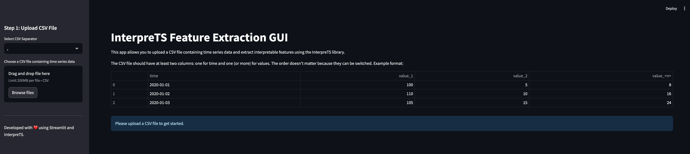
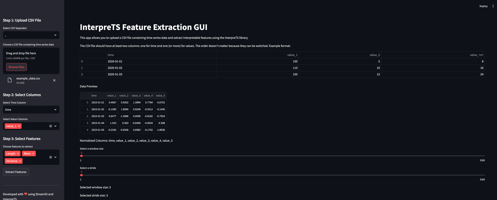
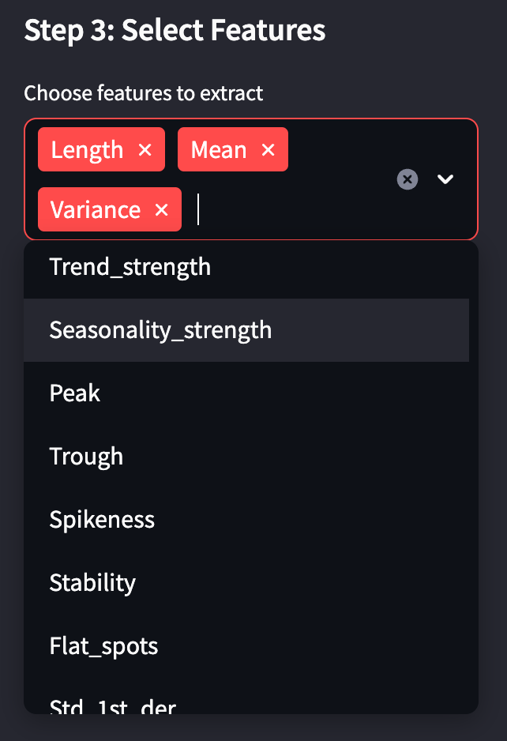
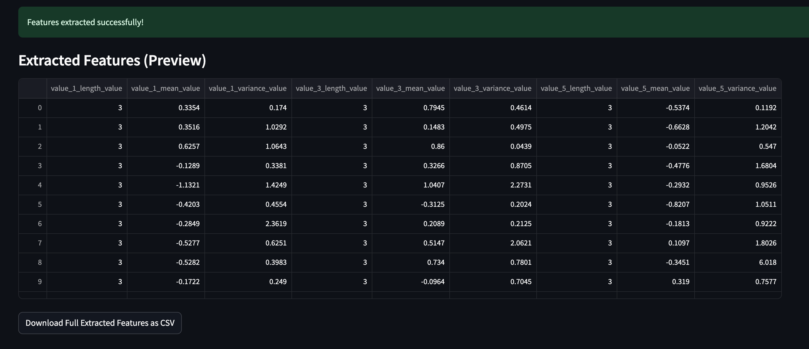

Graphical User Interface (GUI)
==============================

This section provides an overview of how to use the Graphical User Interface (GUI) provided by the library.
The GUI allows users to interact with the library's functionality in a user-friendly way.

Getting Started
---------------

Installation
++++++++++++
Follow the steps below to install the library along with its GUI dependencies.

1. Install the library using ``pip install interpreTS`` or your preferred package manager.
2. Install library from source by cloning the repository and running ``pip install .`` in the root directory.

Launching the GUI
+++++++++++++++++
Once installed, you can launch the GUI by navigating to the GUI directory,:
``cd interpreTS/core/gui`` and
``streamlit run gui.py``.

After executing the command, your default browser will open and display the GUI.

UI Overview
+++++++++++
Below is an overview of the main interface, highlighting each region’s purpose.

- **Sidebar:** Use this area to upload CSV files, select columns, and choose features.
- **Main Window:** Displays data previews, sliders for window/stride, and the extracted features.

Data Upload
+++++++++++
Uploading your CSV file and selecting the appropriate separator are the first steps.

1. Click **Browse files** in the sidebar.
2. Choose the correct separator (comma, semicolon, tab, space).
3. The data preview will appear in the main window.

Feature Extraction
++++++++++++++++++
After specifying your time column and value columns, select the features you wish to calculate.

1. Pick the **Time** column from the dropdown.
2. Select one or more **Value** columns.
3. Check the boxes for the features you want to extract.

Results Preview & Export
++++++++++++++++++++++++
Click on **Extract Features** to calculate rolling window metrics. A preview of your results will appear, and you can download them as a CSV file.

1. Review the first 50 rows of extracted features in the main window.
2. Click **Download Full Extracted Features as CSV** to save the entire dataset locally.

Additional Tips
+++++++++++++++
- Experiment with different window sizes and strides to capture various time-series patterns.
- Use the progress bar to track the computation status for large datasets.
- Keep your CSV files clean (no invalid or missing values in the chosen time column).

